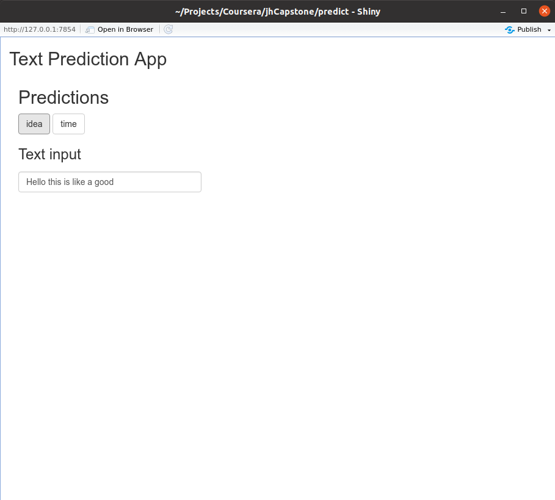

Coursera/Jhon Hopkins Capstone Project
========================================================
author: Felipe Frazatto
date: 02/03/21
autosize: false

Introduction
========================================================

This capstone project proposed an app which could predict the next word of a
user input sentence.

The algorithm should be able to quickly predict a word and allow the user to
choose to add the suggested word to the existing sentence or keep writing.

Text Prediction
========================================================

The algorithm uses a n-gram (n word sequences) database to search for the most
common word combination:

- Text Input
- Divide input into words
- Filter database, based on number and sequence of words
- Suggest next most likely word to be typed

Application UI
========================================================

The UI has a box for text input and two buttons, which labels change based
on what is written inside the text box.

Results
========================================================

- Quickly predict the next word

- User can append the predicted word by clicking on a button

- Coherent word prediction

- App size: 2.7 MB

App available at: [shinyapps.io](http://ffrazatto.shinyapps.io/predict)

